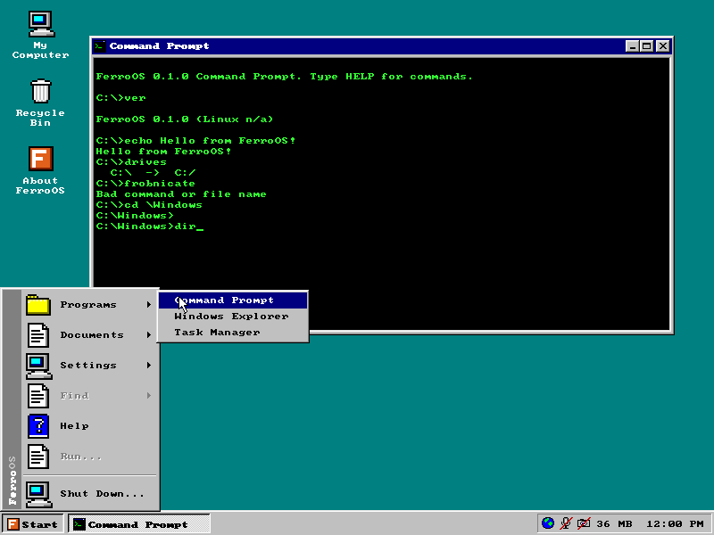
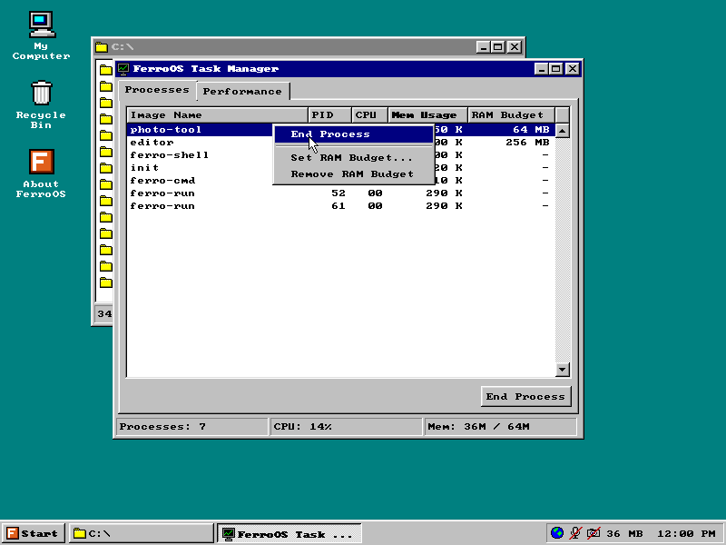
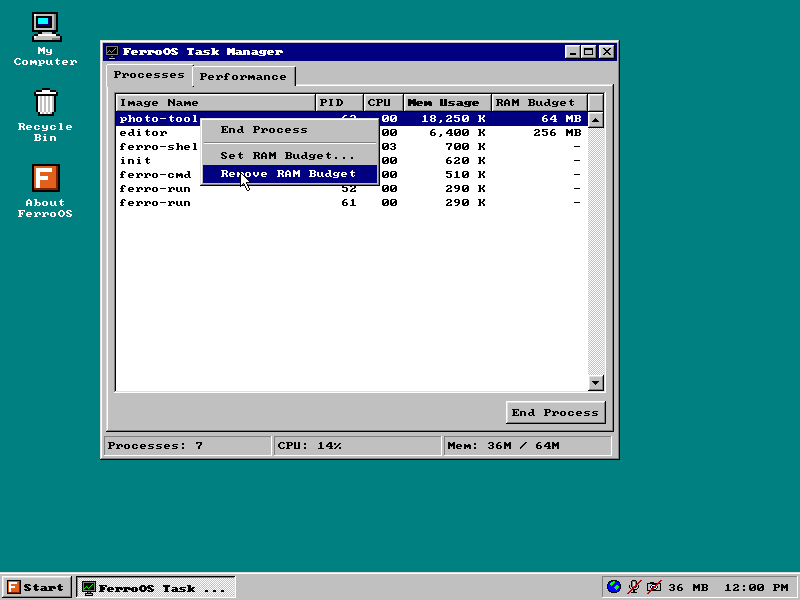
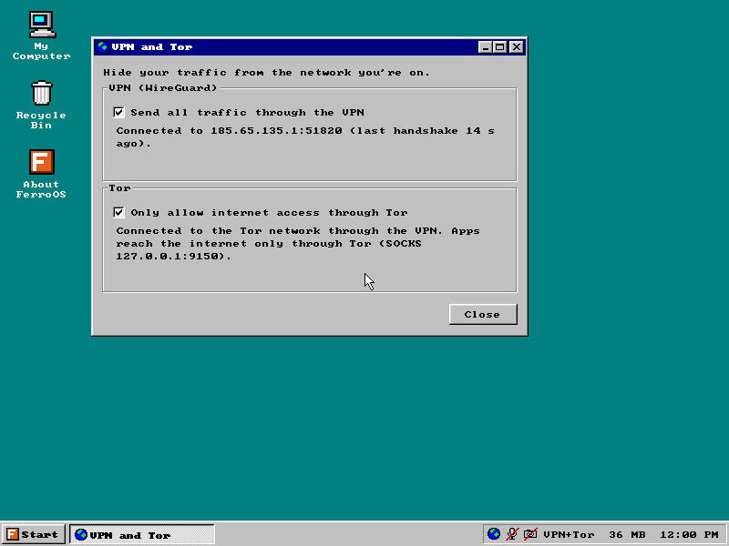
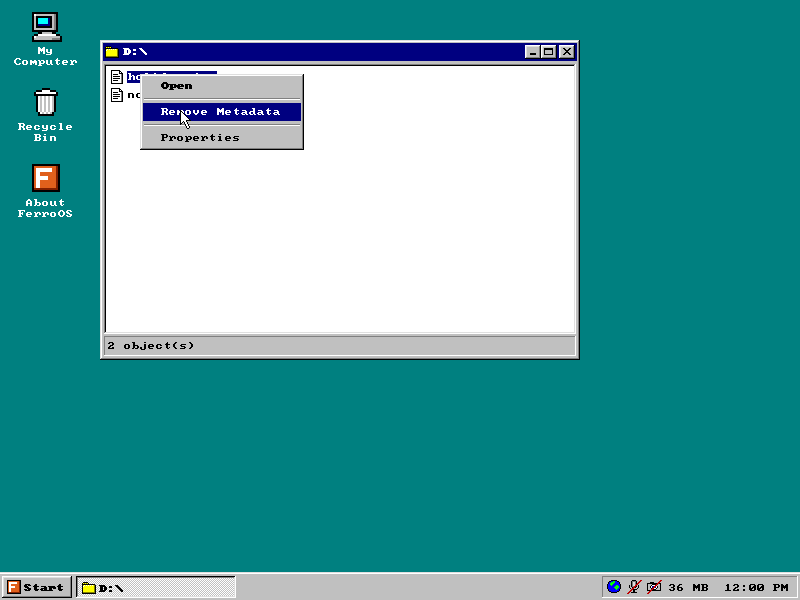
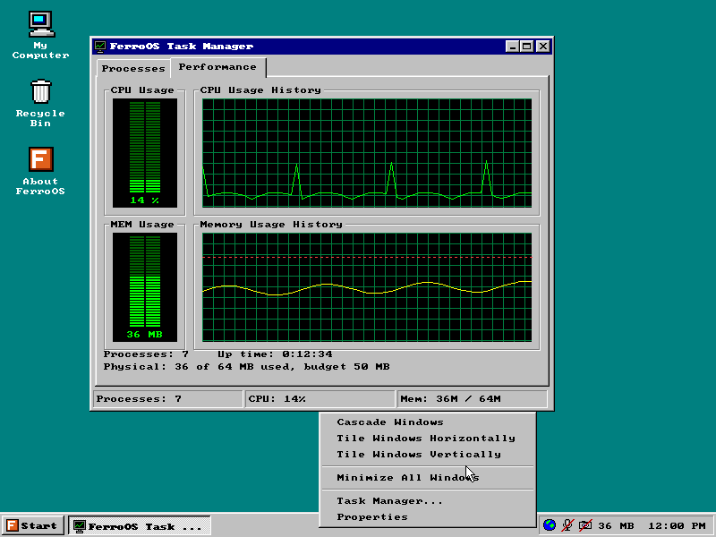
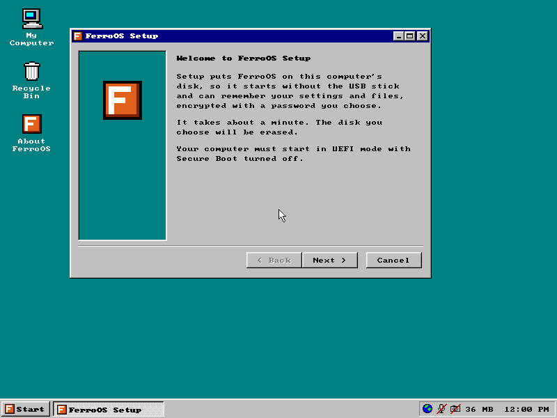

# FerroOS

A small Linux-based OS with a Windows 95 desktop, written in Rust. It idles at
about 29 MB of RAM and tries hard not to leak anything about you.



The Linux kernel only does drivers. Everything on top of it (init, the
desktop, the network stack, the command prompt) is one static Rust binary.
Paths look like `C:\home` because someone asked me to.

> **Heads up:** this is a hobby project. It hasn't been audited and has mostly
> been tested in QEMU. If your safety depends on it, use Tails or Whonix.

## Try it

Grab `ferroos.iso` from [Releases](https://github.com/anti-ghostsec/FerroOS/releases),
flash it to a USB stick with [Rufus](https://rufus.ie) or
[balenaEtcher](https://etcher.balena.io), and boot it. The menu lets you run it
live (nothing is saved) or install it. Installing wipes the disk you pick.

The live USB boots on UEFI or old BIOS machines. Installed systems need UEFI
with Secure Boot off, since the boot loader isn't signed yet.

## What it does

- Your settings and files live in an encrypted vault (Argon2id +
  XChaCha20-Poly1305). Everything else is in RAM and gone at shutdown. No swap,
  no hibernation, no core dumps.
- Apps run sandboxed (Landlock + seccomp + cgroups) and ask before going
  online. You can give each one a RAM limit like `512M` or `5G`.
- Tray switches kill the network, mic and camera at the kernel level.
- DNS goes over HTTPS, TLS uses Encrypted Client Hello, and your MAC address is
  random every boot.
- Optional WireGuard VPN and Tor, both off by default. When they're on, the
  routing table makes it impossible to leak around them, not just unlikely.
  Tor can run through the VPN.
- Right-click a photo to strip its metadata (GPS, camera, etc.).

| | | |
|---|---|---|
|  |  |  |
|  |  |  |

## Using it

The Command Prompt is DOS-flavoured: `DIR`, `CD`, `TYPE`, `MEM`, `PS`, `RUN`.
A few FerroOS-specific ones:

```
MEM /DETAIL           where every KB is going
RUN /NET app          run something with network allowed up front
PERMS /FORGET ALL     forget every remembered app choice
VPN IMPORT D:\x.conf  use your provider's WireGuard file
VPN ON / TOR ON       turn them on (also in Start > Settings > VPN and Tor)
```

Shortcuts: Ctrl+Esc for Start, Ctrl+Shift+Esc for Task Manager, Alt+F4 to
close a window.

## Building

You need [Rust](https://rustup.rs) and [QEMU](https://www.qemu.org). That's it,
even on Windows. The kernel, Tor and the ISO are built inside throwaway QEMU
VMs, so there's no WSL or cross-compiler to set up.

```bash
cargo run -p ferro-preview   # the desktop in a window, any OS
cargo xtask kernel-build     # build Linux (~7 min, once)
cargo xtask run              # boot FerroOS in QEMU with 64 MB
cargo xtask tor-build        # optional: build Tor (~7 min)
cargo xtask iso              # build/ferroos.iso
```

For VPN testing without a provider, `cargo xtask wg-test-server` spins up a
throwaway WireGuard server and drops its profile in `build/import/`, which shows
up as `D:` inside FerroOS. Delete it before building an ISO.

## How it's put together

| | |
|---|---|
| `crates/ferro` | the single binary; it runs whatever program it's started as |
| `ferro-init` | PID 1: mounts, loads only the drivers your hardware needs, supervises services |
| `ferro-shell` | the desktop, drawn in software straight into a DRM buffer |
| `ferro-gfx` | Win95 widgets, font and icons |
| `ferro-cmd` | the command prompt |
| `ferro-system` | the only thing running as root: vault, kill switches, Tor, the installer |
| `ferro-vault` | the encrypted storage format |
| `ferro-sandbox` | `ferro-run`, the app sandbox |
| `ferro-net` | DHCP, DNS over HTTPS, TLS/ECH, VPN and Tor routing |
| `ferro-meta` | metadata stripping for JPEG, PNG and WebP |
| `ferro-path`, `ferro-sys` | `C:\` path mapping, `/proc` readers |
| `ferro-boot` | a tiny UEFI boot loader for installed disks |
| `ferro-preview` | runs the desktop on your normal OS for quick iteration |
| `xtask`, `tools/` | build scripts, kernel config, the build VMs |

## Why it's so small

Most of the RAM savings came from a few boring decisions: one binary instead of
six (they each carried their own copy of the Rust standard library), no kernel
framebuffer console (a second copy of the screen nobody looks at), no kernel
symbol table, and loading only the drivers that match your hardware.

The kernel also likes to size some tables from how much RAM you have. On a
16 GB machine that's around 30 MB of hash tables for an OS that's barely
running anything, so FerroOS pins them on the kernel command line. Run
`MEM /DETAIL` to see the full breakdown.

## Roadmap

- Mute just the mic without killing the speakers
- Read-only, verified system partition and a signed boot loader
- Page flipping and a hardware cursor on real GPUs
- Steam/Proton in a container

## License

MIT or Apache-2.0, whichever you prefer. The ISO also ships the Linux kernel
(GPL-2.0), GRUB (GPL-3.0) and Arti (MIT/Apache-2.0) under their own licenses.
